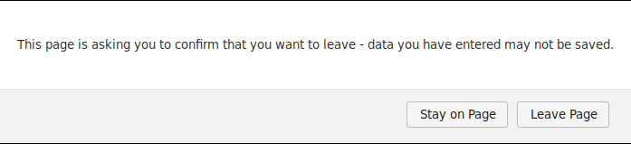

# Blocking navigation with react-router v4



## Introduction

Sometimes you'd want to warn user that changes will be lost once they leave the page. To avoid this you can throw a prompt before they do so. In this article I will show some caveats associated with it and suggest implementation.

In article I will not go into receiving information on how to manage state associated with blocking. I'd recommend having some store which would hold onto boolean which we can access in place we will be blocking.

## Two way of blocking

Let's begin with two sets of situations we have to consider:

1. User closes browser, refreshes or closes tab - I'll call it browser routing
1. User changes route on our site (using react router) - I'll call it react routing

Since these are totally different ways of navigating we have to handle them differently. Let's start with browser actions.

### Browser

To stop user from refreshing page, closing tab or browser we can hook up to `beforeunload` event. For more information see [documentation](https://developer.mozilla.org/en-US/docs/Web/API/Window/beforeunload_event).

To stop user from navigation we should prevent default action of this event as with code below:

```js
addEventListener('beforeunload', (event) => {
    if (shouldBlock) {
        event.preventDefault();
    }
    return event;
});
```

Two point have to be made here:

This event fires also before sending form, so if you're using default form submit you should reconsider using it.

What's more, we cannot modify message of this prompt. It's using default message for browser.

### React routing

We have two options here:

1.  Use [Prompt](https://github.com/ReactTraining/react-router/blob/master/packages/react-router/docs/api/Prompt.md) component from react-router

    This component accepts `when` boolean which when true will trigger confirm alert. We can define message of prompt passing `message` prop. It's important to note that blocking condition (when prop) will only be updated on **rerender**!

    ```js
    <Prompt when={shouldBlock} message="Are you sure you want to leave?" />
    ```

2.  Use [history](https://github.com/ReactTraining/history)

    We can block transitions by subscribing to history.block(). It accepts string (prompt message) or function that might return string.

    ```js
    history.block(() => {
        if (shouldBlock) return promptMessage;
    });
    ```

I would not recommend using Prompt since rerender limitation leads to difficult situations. Image this case - user clicks submit. Since we don't want to stop them from transitioning turning blocking off

```js
<button
    onClick={() => {
        stopBlocking();
        submitForm();
    }}
/>
```

The issue is that Prompt component will not be able to rerender to get new information before executing submitForm thus blocking user. This is not an issue when using history since we don't need a rerender here.

### Navigating to current route

Since every navigation using react router pushes to history stack, even navigating to current location will trigger `history.block()`. We can avoid it by comparing current route with previous.

```js
let lastHistoryLocation;

history.listen(({ pathname }) => {
    lastHistoryLocation = pathname;
});

history.block(({ pathname }) => {
    const pathnameDiffers = lastHistoryLocation !== pathname;
    history.block(() => {
        if (pathnameDiffers && shouldBlock) return promptMessage;
    });
});
```

## Conclusion

Blocking user navigation is not difficult to implement but have significant limitations and caveats. It's worth considering if we're really helping user or making experience worse. If it's not saving them from losing data or create unexpected situation you should probably avoid using this feature.
